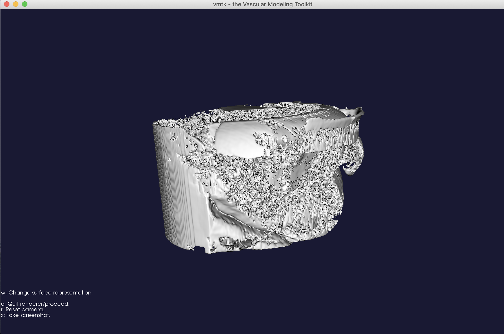
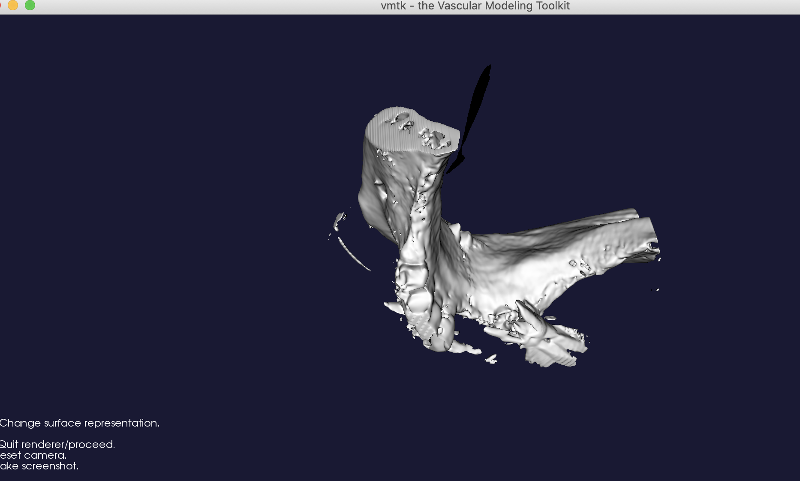

# VA VistAImaging Test

## 1. Study 1: Dental Image 

### Finished images and 3d objects for NN_190528_114613_90E6F.DCM

The converted dental.vtp and dental.stl can be accessed in the following links: 

1. The original dcm dental image:  
https://dirac-dicom-test.s3.amazonaws.com/dental_dicom/NN_190528_114613_90E6F.DCM  

2. The converted dcm image:  
https://dirac-dicom-test.s3.amazonaws.com/dental_dicom/dental_900_smooth_01.stl  


## Background on VMTK Tool to Segment Dcm to STL
VMTK which a python wrapper for implementing [VTK library](https://vtk.org/about/#history). The VTK library has been extensively tested and used by medical laboratories and organizations such as the Army Research Laboratory (ARL), National Instittue of Health, Department of Energy (DOE) ASC Program, 
National Library of Medicine (NLM), Los Alamos National Lab (LANL), and many more.  

VTK employs Kitware’s quality software process, which includes CMake, CTest, CDash, and CPack to build, test, and package the system. Combined with a strong distributed developer community, the result is very high-quality, robust code. The core functionality of VTK is written in C++ to maximize efficiency. This functionality is wrapped into other language bindings to expose it to a wider audience. Interoperability with Python is particularly well-refined.  

## Segmentation scripts

### 1. Dcm to Vti

```bash
 vmtk vmtkimagereader -ifile dental.dcm --pipe vmtkimagewriter -ofile dental.vti
```

### 2. Surface extraction using Marching Cubes 

In order to convert the file into a 3d-shaped object, we need to use the vtk marching cubes class to draw the surface.  

Usually the higher the surface level, the better the details.  Here we have one done at level 200 vs. level 1200.

Usually level 300 is for vascular and tubular organs.  Different organs might require a higher level of surface extraction.  For the dental dcm image here, a level of 700 and above

``` bash
# at level 200, the 3d object has very little detail and does not work with dental dcm
vmtk vmtkmarchingcubes -ifile dental.vti -l 200.0 -ofile dental200.vtp --pipe vmtksurfaceviewer

# at level 700, we see a marked difference in dental dcm
vmtk vmtkmarchingcubes -ifile dental.vti -l 1000.0 -ofile dental1000.vtp --pipe vmtksurfaceviewer

# at level 1200, there is little difference between 700 and 1200. But this is a good level to use.
vmtk vmtkmarchingcubes -ifile dental.vti -l 1200.0 -ofile dental1200.vtp --pipe vmtksurfaceviewer
```

#### Surface extraction at level 200.0


#### Surface extraction at level 1000


### 3. Smoothing the surface  (optional)

Image segmentation can result in bumpy surfaces, especially if the image quality is not high and one didn’t use any curvature term in level sets evolution. Since artifactual bumps in the surface can result in spurious flow features and affect wall shear stress distributions, one may want to increase surface smoothness prior to building the mesh.  

``` bash
vmtksurfacesmoothing -ifile dental900.vtp -passband 0.1 -iterations 30 -ofile dental_900_smooth_01.vtp 
```

### 4. Finally, convert vtp to stl

``` bash
vmtk vmtksurfacereader -ifile dental900_smooth_01.vtp --pipe vmtksurfacewriter -ofile dental_900_smooth_01.stl
```
